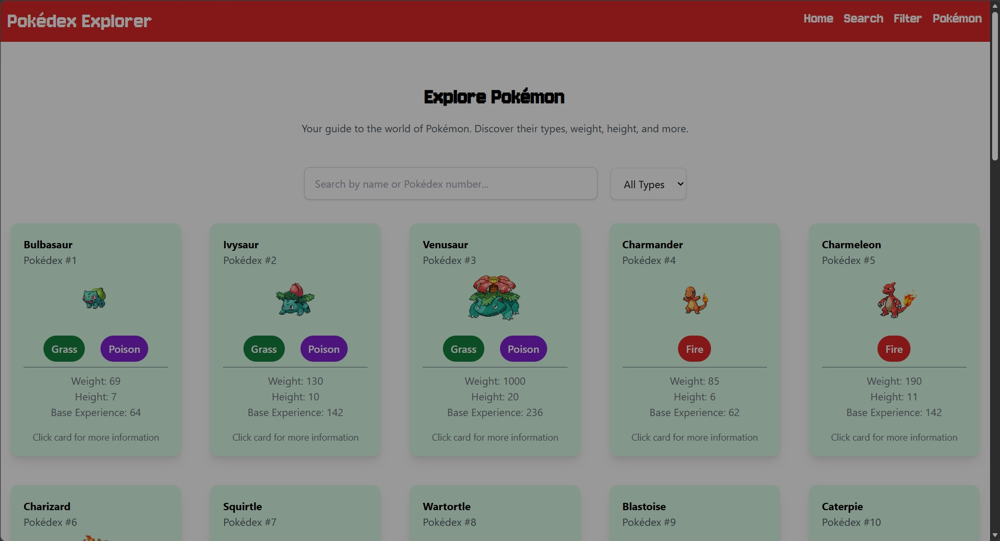
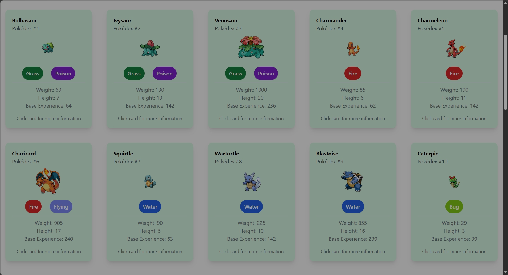
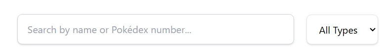
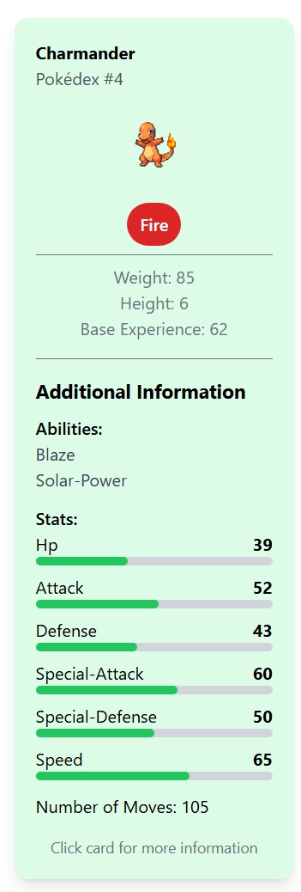

# Pokédex Explorer

**Janis Marshall**

---

## Project Description

Pokédex Explorer is an interactive web application that allows users to explore information about the first 151 Pokémon.

Users can search for Pokémon by name or Pokédex number, filter Pokémon by type, and view additional information such as abilities, base stats, height, weight, and number of moves.

---

## Technologies Used

- HTML
- CSS
- JavaScript
- jQuery
- Tailwind CSS
- Google Fonts

---

## API Used

This project uses **PokéAPI** to retrieve Pokémon data.

- **API:** PokéAPI
- **Website:** https://pokeapi.co/

The application retrieves information including:

- Pokémon names
- Pokédex numbers
- Images
- Types
- Abilities
- Height
- Weight
- Base experience
- Base stats
- Number of moves

---

## Features

### 🔎 Pokémon Search

Users can search for Pokémon by:

- Pokémon name
- Pokédex number

### 🏷️ Type Filtering

Users can filter Pokémon by type:

- Normal
- Fire
- Water
- Grass
- Electric
- Ice
- Fighting
- Poison
- Ground
- Flying
- Psychic
- Bug
- Rock
- Ghost
- Dragon
- Dark
- Steel
- Fairy

### 📋 Pokémon Information Cards

Each Pokémon is displayed in an interactive card containing:

- Pokémon name
- Pokédex number
- Pokémon image
- Type badges
- Weight
- Height
- Base experience

### 📊 Additional Information

Clicking a Pokémon card displays additional information including:

- Abilities
- Base stats
- Stat progress bars
- Number of moves

### 🎨 Type-Based Colors

Each Pokémon type has its own background color to make the cards easier to identify.

### ➕ Load More

The application initially displays 30 Pokémon and allows users to load more Pokémon using the **Load More** button.

### 📱 Responsive Design

The website uses Tailwind CSS to create a responsive layout that works across different screen sizes.

### ⚠️ Error Handling

If the PokéAPI cannot be reached, the application displays a user-friendly error message.

---

## Challenges

One of the main challenges was working with data from an external API.

The initial API request provides basic Pokémon information and URLs to each Pokémon's detailed data. I had to make additional requests to retrieve information such as types, abilities, stats, and images.

Another challenge was dynamically creating the Pokémon cards using JavaScript and displaying the API data in the correct HTML elements.

---

## What I Learned

Through this project, I learned how to:

- Work with REST APIs using `fetch()`
- Use `async` and `await`
- Handle API errors using `try`, `catch`, and `finally`
- Manipulate the DOM using jQuery
- Create responsive layouts using Tailwind CSS
- Work with nested API data

---

## Future Improvements

In the future, I would like to:
- Add all Pokémon
- Add dark mode
- Add Pokémon evolution information
- Improve the loading animation
- Allow users to compare multiple Pokémon
- Improve accessibility and keyboard navigation

---

## Screenshots

### Home Page

### Pokémon Cards

### Search and Filter

### Additional Pokémon Information

---

## Live Website

[**View the Live Website**](https://janis-marsh.github.io/Pokedex-Explorer/)

---
